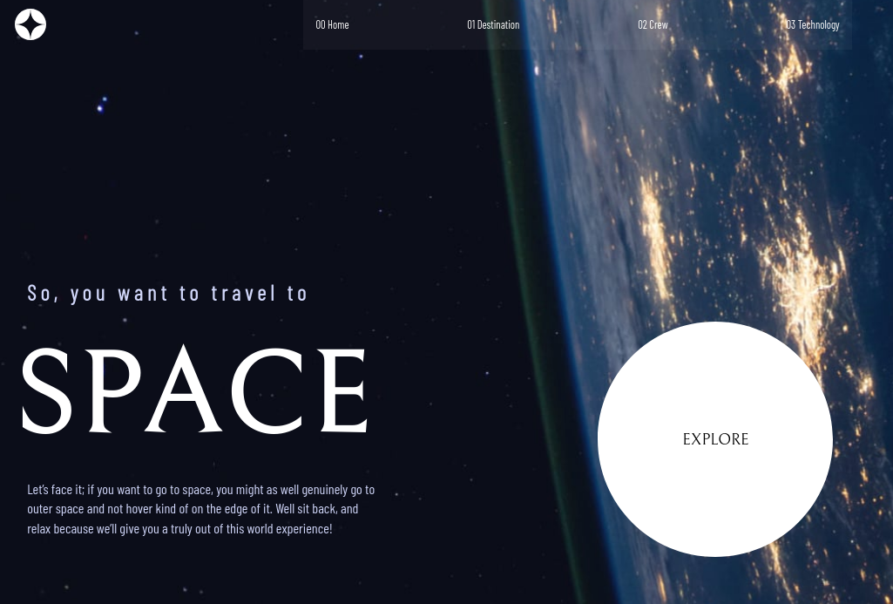

#  Space tourism website solution
 

## Table of contents

- [Overview](#overview)
  - [Screenshot](#screenshot)
- [My process](#my-process)
  - [Built with](#built-with)
  - [Useful resources](#useful-resources)
- [Author](#author)

## Overview

### Screenshot

- [live-URL](https://elated-poitras-4edcf9.netlify.app/)

## My process

### Built with

- Semantic HTML5 markup
- CSS custom properties
- Flexbox
- grid
- javaScript
- fetch API
- JSON
- SCSS

### Useful resources

- [w3schools](https://www.w3schools.com/) - tutorial for html and css
- [MDN Web Docs](https://developer.mozilla.org/en-US/docs/Web/HTML) - Documentation for html

## Author

- github - [gwtpraveen](https://github.com/gwtpraveen)
- Frontend Mentor - [@gwtpraveen](https://www.frontendmentor.io/profile/gwtpraveen)
- Twitter - [@gwtpraveen](https://twitter.com/gwtPraveen)

